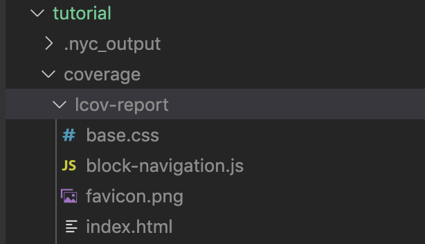
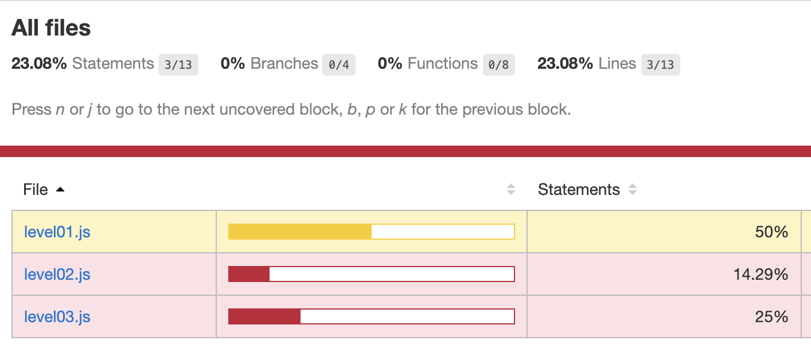
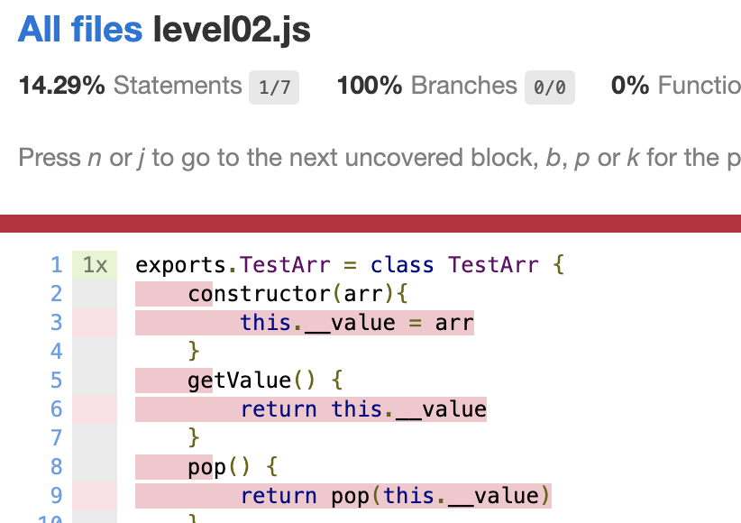

# 테스트 튜토리얼
해당 테스트는 Level들로 이루어져 있습니다. Level의 달성량을 채우면서 테스트 코드에 대해서 학습할 수 있습니다.

## 시작하기

의존성을 설치해주세요 :)
```
npm i
```

테스트만 할 경우에는 다음 명령어를 입력해주세요

```
npm run test
```

Level의 달성량을 확인하기 위해 다음 명령어를 사용해주세요

```
npm run coverage
```

## Level 달성량 확인하기

`npm run coverage`를 실행하면 tutorial 디렉토리에 coverage 파일이 생성됩니다.
 
 이후 lcov-report 안의 index.html 파일을 브라우저에서 엽니다.




브라우저를 열면 Level 별로 할당량을 확인 하실 수 있습니다.





붉은 줄로 밑줄이 그여진 부분은 테스트가 되지 않는 영역입니다.

해당 영역을 테스트하여 `Statements`가 100%가 되게 하는 것이 우리의 목표입니다.

## 스테이지 가이드

### level1 
덧셈 함수를 테스트 해서 통과 해주세요!

### level2
덧셈 함수에서 숫자가 아닐때는 에러를 발생합니다.
덧셈 함수와 함께 에러에 대한 테스트를 추가해주세요!

### level3
테스트 배열 인스턴스의 각 함수들을 테스트 해주세요!

### level4
지금까지와는 다르게 데이터 베이스와 연결하여 테스트합니다.
before를 이용하여 테스트 이전에 디비를 연결하고 초기화 해주세요.
after를 이용하여 이후에는 연결을 종료해주세요

### level5
테스트를 skip하여 성공할 수 없는 테스트를 피합니다.

### level6
이번 스테이지에서는 직접 테스트 코드를 돌리지 않습니다.
브라우저를 통해서 모카를 실행시켜 봅니다.
level06.html파일을 브라우저로 열어주세요.

### level7
Headless Browers Controller인 Puppeteer를 이용하여 DOM Element를 테스트 합니다.
Element의 Text를 읽고, 클릭하여 라우팅하여 다음 페이지를 테스트합니다.
마지막엔 결과 스크린샷을 합니다.

### level8
모카 실행파일을 직접 사용하지 않고, 모카 인스턴스를 다룹니다.

### level9
유저 인터페이스 빌더인 리액트를 테스트 합니다.
리액트로 생성된 컴포넌트의 이벤트를 발생시키고, state를 변경시켜 결과를 테스트합니다.